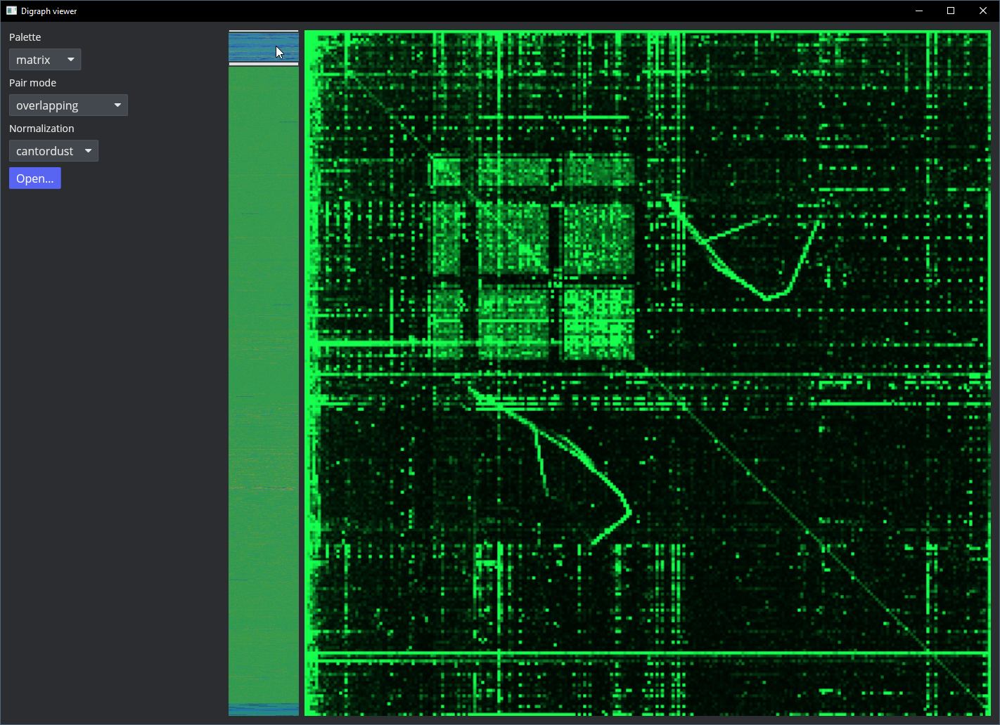

# iced_digraph

An **interactive digraph heatmap** for raw binary data, built with [Iced](https://github.com/iced-rs/iced).
Useful for reverse engineering unknown byte streams.

## Screenshot



## Run

```bash
cargo run --release
```
